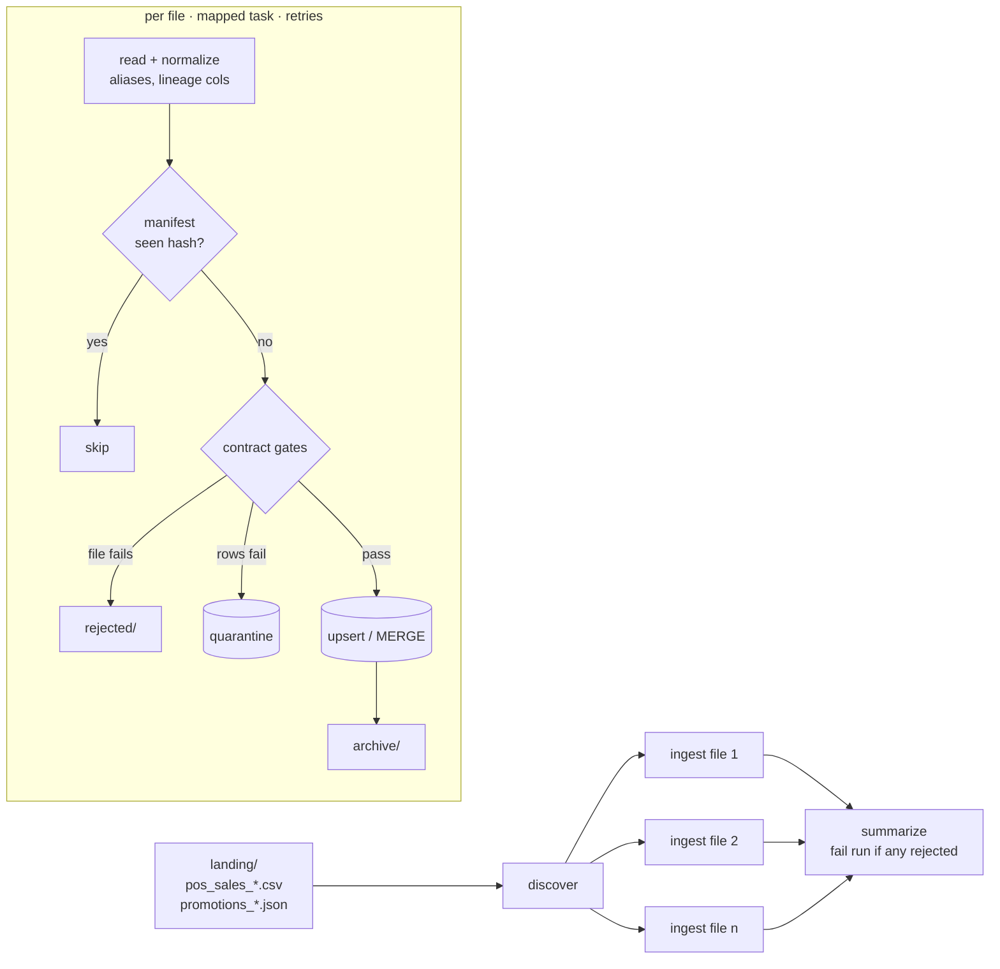

# airflow-vendor-ingestion

Airflow ingestion for third-party vendor file drops (CSV and nested JSON). Each feed has a **data contract**. Files pass file-level and row-level **quality gates**, bad rows go to **quarantine** with reasons, a **file manifest** makes loads idempotent, and warehouse loads are **upserts** (SQLite locally, generated `MERGE` for Snowflake). **All vendor data is synthetic.**



## Quality gates

| Level | Gate | Outcome |
|---|---|---|
| File | Required column missing | File rejected, moved to `rejected/` |
| File | Reject ratio above the contract limit (default 5%) | File rejected |
| File | Newest business date older than `max_age_days` | File rejected as stale |
| Row | Type coercion failure (`units:bad_int`) | Quarantined |
| Row | Null in required column, value outside allowed set, below minimum | Quarantined |
| Row | Duplicate business key within the file | Quarantined |

Every row keeps `_source_file`, `_file_hash` and `_ingested_at` for lineage.

## Sample run

```text
pos_sales_20260929_a.csv   loaded    299 valid, 0 quarantined
pos_sales_20260929_b.csv   loaded    196 valid, 4 quarantined
pos_sales_20260929_c.csv   rejected  missing required columns ['net_sales']
promotions_20260929.json   loaded     12 valid, 0 quarantined
```

Running it again with the same files skips all of them (the file hash is already in the manifest), and table counts don't change.

## Layout

| Path | Purpose |
|---|---|
| `ingest/contracts.py` | Column types, required flags, allowed values, minimums, business keys, column aliases, freshness |
| `ingest/readers.py` | CSV / JSON / JSON Lines readers, snake-casing, aliasing, lineage columns |
| `ingest/validate.py` | File- and row-level gates → `valid`, `quarantine`, `stats` |
| `ingest/manifest.py` | Processed-file manifest keyed by SHA-256 |
| `ingest/load.py` | `SQLiteLoader` (`ON CONFLICT` upsert), `SnowflakeLoader` (`write_pandas` + `MERGE`), `merge_sql()` |
| `ingest/process.py` | One file end to end; shared by the DAG and the CLI |
| `dags/vendor_ingestion.py` | TaskFlow DAG: dynamic task mapping, retries with backoff, failure callback, `all_done` summary |

## Run it

```bash
pip install -r requirements.txt
python scripts/generate_drops.py data/landing
python scripts/run_local.py data
pytest -q
```

To run it in Airflow, point `VENDOR_LANDING`, `VENDOR_ARCHIVE`, `VENDOR_REJECTED`, `WAREHOUSE_DB` and `MANIFEST_DB` at your paths and put the repo in your DAGs folder. CI also runs a DAG integrity test against Airflow 2.10.

## Extending

Add a `Contract` to `ingest/contracts.py` and the DAG picks up the new feed automatically. To target BigQuery, the same `merge_sql` works with a staging table loaded through `load_table_from_dataframe`.
